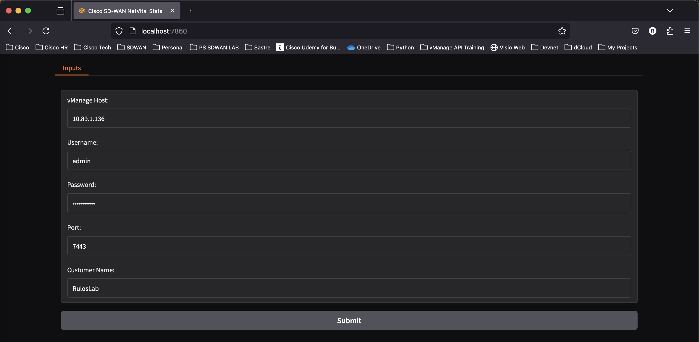
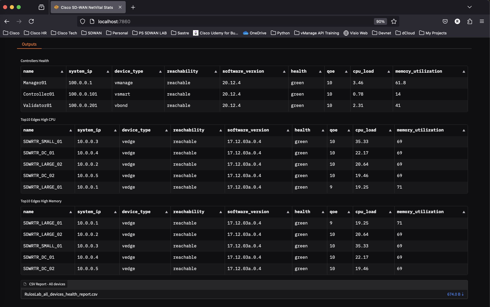

# Cisco SD-WAN NetVital Stats"

## Description

Web application to collect CPU and Memory Statisticts on a Cisco SD-WAN Network

## Requirements

Clone repository and use pip to install requirements

    pip install -r requirements.txt

Host running the script must have connectivity to Cisco SDWAN Manager

## Execution

Execute python file

    python main.py

    (netvital) user@netvital%python main.py 
    * Running on local URL:  http://127.0.0.1:7860

Copy displayed URL to enter web interface

Provide the required fields (vManage URL, credentials and Customer Name) and click on the submit button

This will start a connection to vmanage and populate the results on the outputs section, a CSV file with the full report of device stats will be available to download at the bottom

## References

    https://developer.cisco.com/docs/sdwan/

## Author

Raul Gomez

    rgomezbe@cisco.com

## Comments

Please use the issues section to report bugs and requests new features
